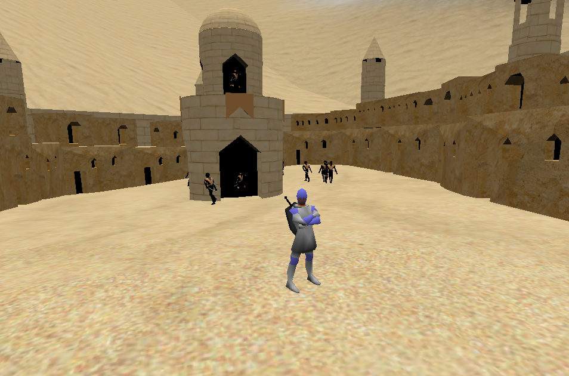
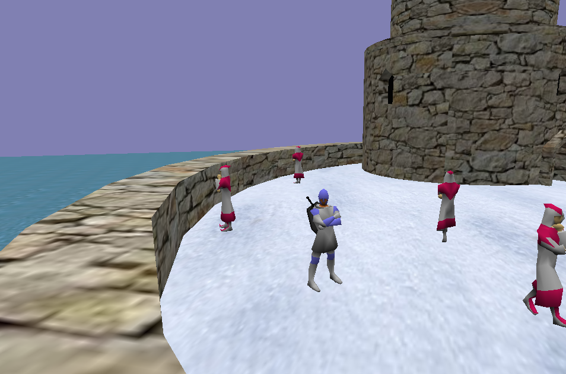
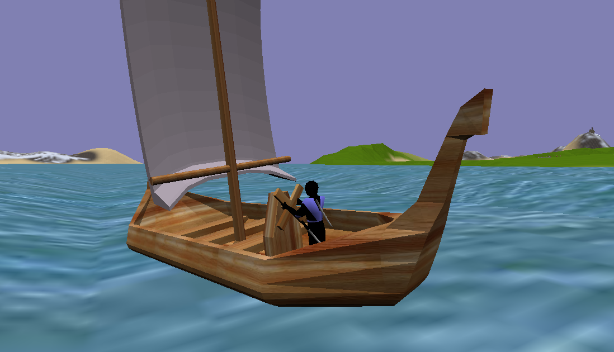
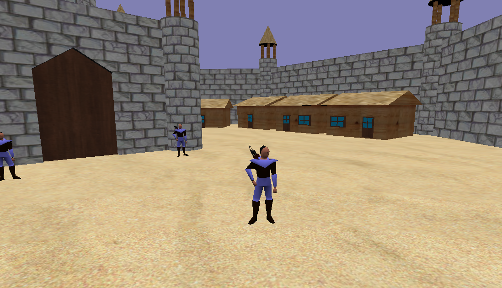
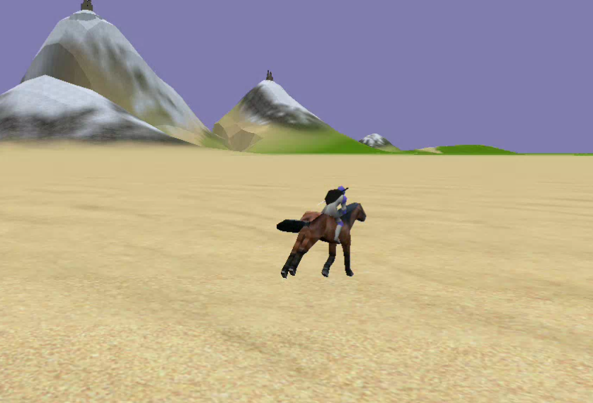

# nine-clj

Simple and mighty 3D game engine for Clojure.
Primary features :
- Skeletal animation
- COLLADA models import
- 3D physics with COLLADA shapes
- Particle systems
- Text rendering with custom fonts
- Async resources load
- Networking (TCP/UDP)

Datum is a game made using this library.
See screenshots :
## Desert castle

## Mages tower

## Sailing mechanics

## Player's own castle

## Horse riding

