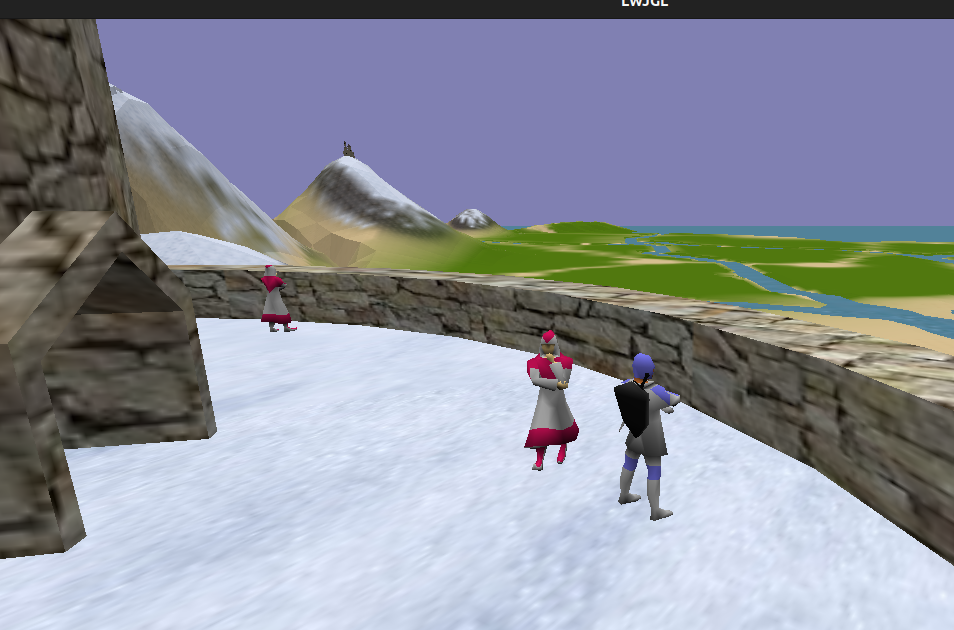

# nine-clj

Simple and mighty 3D game engine for Clojure.
Primary features :
- Skeletal animation
- COLLADA models import
- 3D physics with COLLADA shapes
- Particle systems
- Text rendering with custom fonts
- Async resources load
- Networking (TCP/UDP)

Datum is a game made using this library.
See screenshots :
## Desert castle

## Mages tower


## Sailing mechanics

## Player's own castle

## Horse riding


## As a Leiningen dependency
```
[org.clojars.taqmuraz/nine-clj "0.1.1"]
```

## As a Clojure deps.edn dependency
```
org.clojars.taqmuraz/nine-clj {:mvn/version "0.1.1"}
```

## As a Gradle dependency
```
implementation("org.clojars.taqmuraz:nine-clj:0.1.1")
```

## As a Maven dependency
```
<dependency>
  <groupId>org.clojars.taqmuraz</groupId>
  <artifactId>nine-clj</artifactId>
  <version>0.1.1</version>
</dependency>
```
